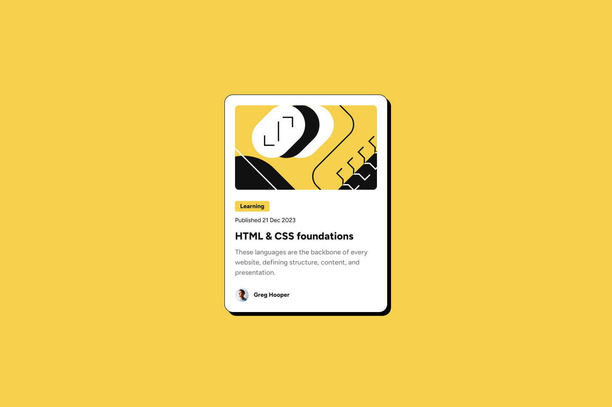

# My fourteenth project and solution to the blog preview card challenge over at [Frontend Mentor](https://www.frontendmentor.io/challenges)

## Table of contents
- [The challenge](#the-challenge)
- [Goals](#goals)
- [Assignment design](#this-was-the-design)
- [My solution with live page link](#this-is-my-solution)
- [What I learned](#what-i-learned)
- [Tools used](#tools-used)

## The challenge

After over 2 years of cancer treatment, my main challenge was to get back to my original goal of learning front-end development. I took a 6-month super-intensive back-end Java web-application development course and now I need to brush up on what I had learned before I stopped 2 years ago and go forward.

My users should be able to:

- [x] View the optimal layout depending on their device's screen size
- [x] See a hover state

## Goals

My goals for this project were to:

- [x] Code cleanly
- [x] Comment my code if I use a non-standard approach
- [x] Use CSS Variables
- [x] Use CSS Flexbox to create the layout
- [x] Use Git for version control

## This was the design

## This is my solution

[Click here to see the live page](https://arthurpog.github.io/blog-preview-card/)

## What I learned

Nothing new. Just brushed up some of my cobwebbed knowledge and gained some momentum to realize more projects.

Specifically:

- I can use the gap property in a Flexbox
- I used the @font-face fule in CSS and load in fonts, because the font in question (Sparta) is no longer available through Google Fonts
- I used the self position properties of items located in a grid (justify-self, align-self, position-self) for the first time

## Tools used

- **VS Code** with a few extensions:
  - **CSS Peek** - To immediately see what certain variables that I set mean and their values by holding CRTL + hovering over the value
  - **HTML to CSS Autocompletion** - Quickly autocomplete classes and ID names in CSS based on what I created in HTML
  - **Live Preview** - Right-clicking the index.html offers to view a live and constantly auto-updated version of the web-page for a quick live view of one's work
- **GitBash** - an amazing GIT command line emulator for Windows for version control
- **Greenshot** - A fantastic little open-source tool that is like a screenshot on steroids. After pressing PrtScrn it lets one exactly measure the width and height of an element on a screen basically making it very easy to calculate how big certain margins, paddings, containers and font-sizes are in a design without having access to a wire-frame.
- **Microsoft PowerToys** - A nifty little program from Microsoft adding a *plethora* of UI functionality to Windows. What I use most for coding is CTRL+WIN+C it brings up a colour picker, and when I hover over something or click something it shows me the HEX, RGB, HSL and CMYK values of the colour that can instantly be copied to the clipboard and in addition to this it keeps a history of all the colours picked. Amazing!
